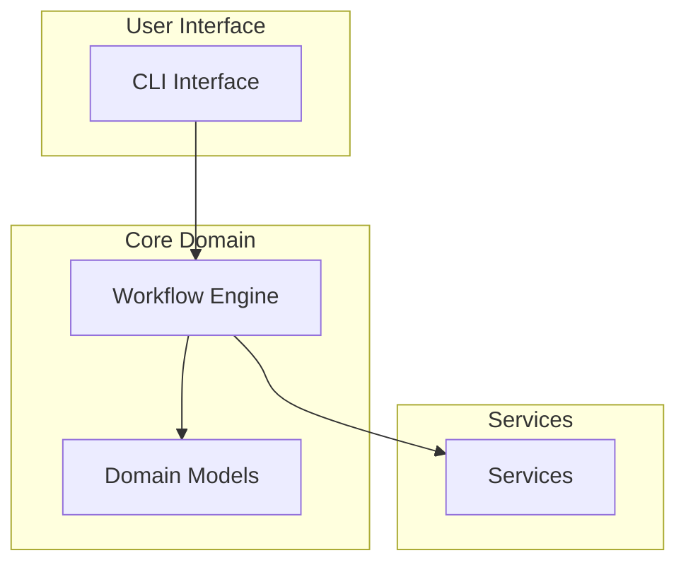

# Architecture Document

> **Status:** `DRAFT` | `REVIEW` | `LOCKED`  
> **Last Updated:** YYYY-MM-DD

---

## System Overview

[Describe what the system does and its primary purpose]

---

## Component Diagram

---

## Technology Decisions

| Decision | Choice | Rationale |
|----------|--------|-----------|
| Language | Python 3.9+ | Team expertise |
| Testing | pytest | Standard, good plugins |
